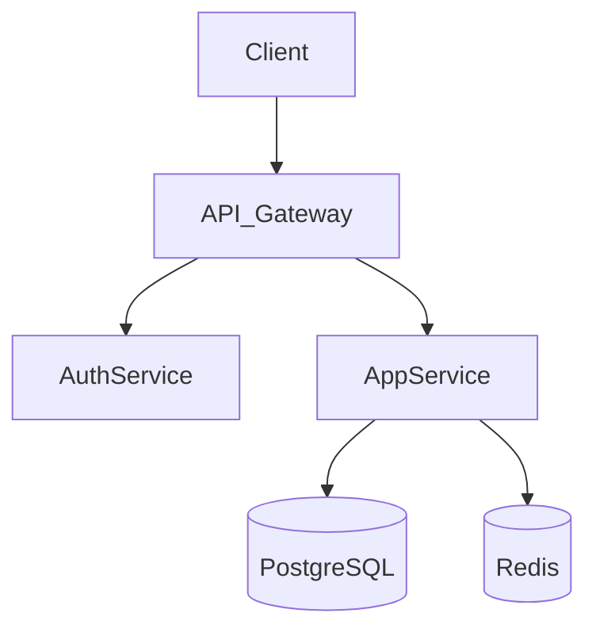
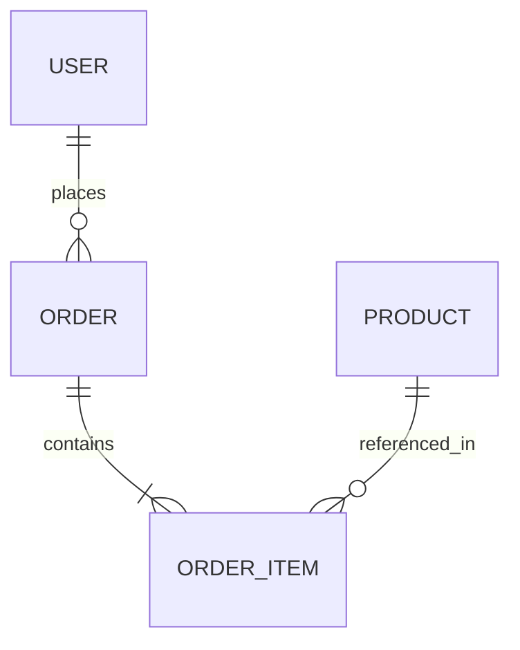
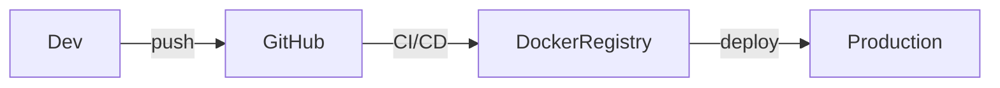

# Software Documentation Skill

Generate complete, professional documentation packages for any software project — APIs, web apps, mobile apps, e-commerce platforms, CLIs, microservices, and more.

This skill covers **five documentation categories**. Each project may need one or several. Always identify what's needed before writing.

---

## Step 1: Gather Context

Before writing, determine:
- **Project name, purpose, and type** (API, web app, e-commerce, mobile, internal tool, etc.)
- **Tech stack** — language, framework, DB, infrastructure
- **Project phase** — in development, recently delivered, or being maintained?
- **Audience** — who will read each document (devs, client, QA, IT ops, legal)?
- **Existing docs** — what already exists? Avoid duplication.
- **Delivery format** — Markdown (default), PDF, Confluence/Notion export, HTML?

If the user shares a repo or codebase, explore it first and extract what you can before asking questions.

---

## Step 2: Identify Documentation Category and Type

### Category 1 — Technical Documentation (for developers)
*Goal: any developer can understand, install, and extend the system without asking the original author.*

| Document | Description | Reference |
|---|---|---|
| **README + Installation Guide** | Project overview, setup, dev and prod deploy | Template below |
| **Architecture Document (SAD)** | Global structure, tech stack, design patterns, component communication | `references/technical.md` |
| **Data Dictionary / DB Model** | Tables, relationships, field types, indexes | `references/technical.md` |
| **API Documentation** | Endpoints, parameters, request/response, auth, error codes | `references/api-docs.md` |
| **Contribution Guide** | Fork, branch, PR, commit standards, code style | `references/technical.md` |
| **Inline Code Docs** | JSDoc, docstrings, type annotations guidance | `references/technical.md` |

### Category 2 — User & Functional Documentation (for the client / end users)
*Goal: explain what the system does and how to use it — no unnecessary technical jargon.*

| Document | Description | Reference |
|---|---|---|
| **User Manual / Admin Guide** | Step-by-step usage for end users or admin roles | `references/user-docs.md` |
| **User Stories / Use Cases** | Record of agreed and delivered functionalities | `references/user-docs.md` |
| **Glossary of Terms** | Definitions of domain-specific terms used in the system | `references/user-docs.md` |
| **Changelog / Release Notes** | Version history, new features, breaking changes | `references/user-docs.md` |

### Category 3 — Quality & Testing Documentation (QA)
*Goal: demonstrate that the software works correctly and is secure.*

| Document | Description | Reference |
|---|---|---|
| **Test Plan & Report** | Unit, integration, and UAT results | `references/qa-docs.md` |
| **Vulnerability / Security Report** | OWASP coverage, security findings, mitigations | `references/qa-docs.md` |
| **Traceability Matrix** | Maps each requirement to its implemented feature and test | `references/qa-docs.md` |

### Category 4 — Operational & Support Documentation (IT / DevOps)
*Goal: keep the system running and recoverable after incidents.*

| Document | Description | Reference |
|---|---|---|
| **Backup & Recovery Protocol** | Backup frequency, retention, restoration steps | `references/ops-docs.md` |
| **Infrastructure Configuration** | Servers, SSL, DNS, cloud services, env vars | `references/ops-docs.md` |
| **Known Issues Log** | Bugs with workarounds or deferral reasons | `references/ops-docs.md` |
| **Runbook / Incident Response** | Steps for common failures, on-call procedures | `references/ops-docs.md` |

### Category 5 — Legal & Closure Documentation
*Goal: formally close the project and document rights, obligations, and support terms.*

| Document | Description | Reference |
|---|---|---|
| **Acceptance Certificate** | Signed client confirmation of project delivery | `references/legal-docs.md` |
| **License Inventory** | Third-party libraries and their open-source licenses | `references/legal-docs.md` |
| **Maintenance & Warranty Contract** | Post-delivery support terms and SLA | `references/legal-docs.md` |

---

## Step 3: Propose a Documentation Package

When the need is broad, propose a tailored package before writing:

```
Based on your project, I suggest generating:
✅ Category 1: README, Architecture Doc, API Reference
✅ Category 2: Admin User Manual, Glossary
✅ Category 3: Test Report, Traceability Matrix
✅ Category 4: Infrastructure Config, Known Issues Log
✅ Category 5: Acceptance Certificate, License Inventory

Which do you need first, or shall I start with the full set?
```

Prioritize by delivery urgency — closure docs first for finished projects, technical docs first for active development.

---

## Step 4: Write the Documentation

General principles:
- **Lead with what matters most**: overview → setup → core usage → edge cases
- **Copy-pasteable code blocks** for all commands, configs, and examples
- **Adapt language to audience**: precise and technical for devs, clear and plain for end users
- **Table of contents** for any doc with more than 4 sections
- **Warnings and notes** for breaking changes, security considerations, irreversible actions
- **Mermaid diagrams** for architecture, flows, and data models — embed inline

Read the relevant reference file before drafting each document type.

---

## Step 5: Present, Validate, and Iterate

- Present the draft in the conversation with clear section markers
- Flag assumptions explicitly: *"Asumí que usas PostgreSQL — corrígeme si es diferente"*
- Offer choices for structural decisions: *"¿El glosario va dentro del manual o como documento separado?"*
- Incorporate feedback and deliver a final `.md` file (or other requested format)

---

## README Template (baseline for any project)

```markdown
# Project Name

> One-sentence description of what it does and who it's for.

## Table of Contents
- [Features](#features)
- [Requirements](#requirements)
- [Installation](#installation)
- [Quick Start](#quick-start)
- [Configuration](#configuration)
- [Documentation](#documentation)
- [Contributing](#contributing)
- [License](#license)

## Features
- Feature 1
- Feature 2

## Requirements
- Runtime: Node.js >= 18 / Python >= 3.10 / PHP >= 8.1
- Database: PostgreSQL 15+ / MySQL 8+ / MongoDB 6+

## Installation
\`\`\`bash
git clone https://github.com/org/project.git
cd project
npm install
cp .env.example .env
\`\`\`

## Quick Start
\`\`\`bash
npm run dev
\`\`\`

## Configuration
| Variable | Description | Required |
|---|---|---|
| `DATABASE_URL` | DB connection string | ✅ |
| `JWT_SECRET` | Auth token secret | ✅ |

## Documentation
- [API Reference](./docs/api.md)
- [Architecture](./docs/architecture.md)
- [User Manual](./docs/user-manual.md)

## Contributing
See [CONTRIBUTING.md](./CONTRIBUTING.md)

## License
MIT
```

---

## Mermaid Diagram Patterns

**System architecture:**


**Entity-Relationship:**


**Deployment pipeline:**


---

## Reference Files

Read the relevant file before drafting. Don't load all at once — only what the current document needs.

| File | Contents |
|---|---|
| `references/api-docs.md` | REST/GraphQL patterns, endpoint blocks, auth, error codes |
| `references/technical.md` | Architecture SAD, data dictionary, contribution guide, inline docs |
| `references/user-docs.md` | User manuals, use cases/stories, glossary, changelogs |
| `references/qa-docs.md` | Test plans, security reports, traceability matrix |
| `references/ops-docs.md` | Backup protocols, infrastructure config, runbooks, known issues |
| `references/legal-docs.md` | Acceptance certificates, license inventory, maintenance contracts |

---

## Quick Examples

**"Documenta la arquitectura de mi app de microservicios en Go"**
→ Read `references/technical.md` → produce SAD with component diagram, tech stack table, communication patterns

**"Necesito el acta de entrega para firmar con el cliente"**
→ Read `references/legal-docs.md` → produce formal acceptance certificate with scope summary, deliverables checklist, and signature blocks

**"Genera el plan de pruebas para mi e-commerce"**
→ Read `references/qa-docs.md` → produce test plan covering unit, integration, UAT, and security test cases

**"Crea la documentación completa de mi API GraphQL"**
→ Read `references/api-docs.md` → produce schema overview, query/mutation reference, auth flow, error handling guide

**"Necesito el protocolo de backup para la app en producción"**
→ Read `references/ops-docs.md` → produce backup protocol with schedule, retention policy, and restoration steps
